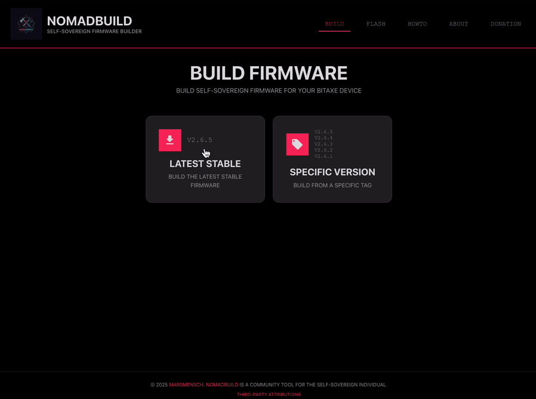
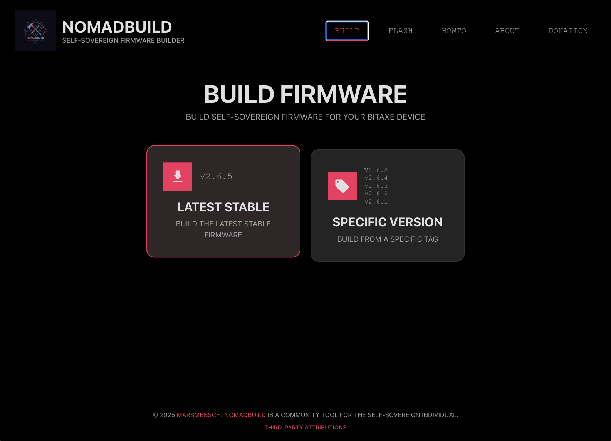
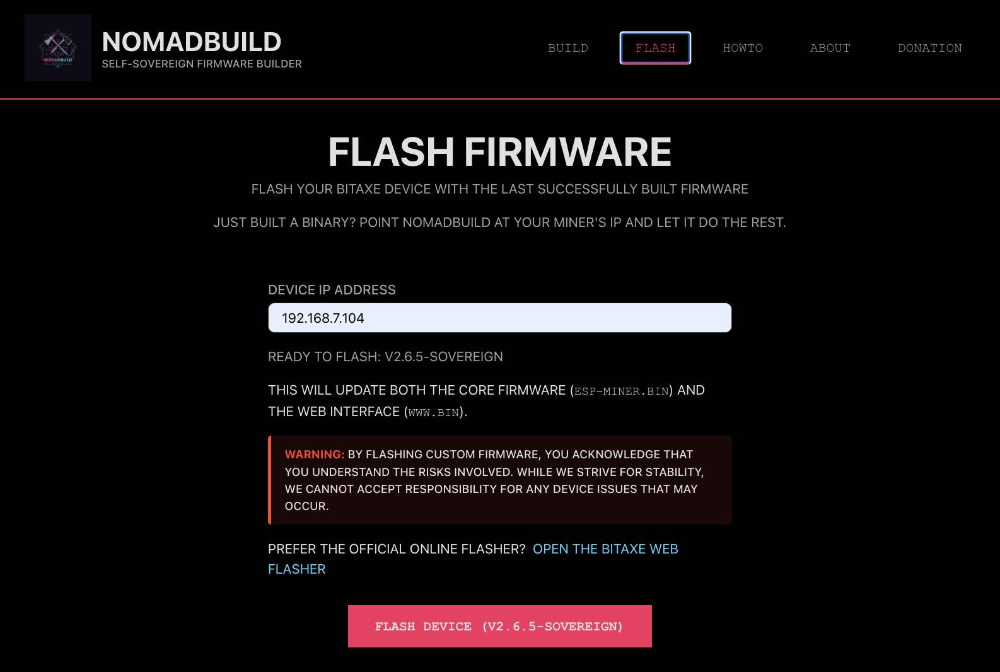

# NomadBuild


> Self-sovereign Bitaxe firmware builder & flasher.

+

## TL;DR Quick-Start

```bash
# 1. Build (or update) the local Docker image
./nomadbuild.sh --build-image

# 2. Launch the Web-UI
./nomadbuild.sh --webui
```

Navigate to http://localhost:9090 and follow the on-screen steps to build or flash your Bitaxe firmware.

## Features

* 100 % reproducible builds from upstream ESP-Miner sources
* One-click flashing over LAN
* Cancelable builds, progress bar, realtime logs

## Test cases

```bash
# Run tests
./scripts/test.sh
```

See `docs/TESTING.md` for detailed guidance.

## License

MIT © 2025 marsmensch

## Motivation: Building Trust in Open Source Hardware

The Bitaxe project offers fantastic open-source hardware, but how can you be sure the firmware running on your device truly matches the public source code? Relying solely on pre-compiled binaries introduces trust assumptions about the build process and distribution channel.

**Self-sovereign building** empowers users by allowing them to compile the firmware directly from the official source code within a controlled environment. This tool aims to make that process accessible.

The "gold standard" is **reproducible builds**, where identical source code and build environments produce byte-for-byte identical binaries. While perfectly matching official release binaries is difficult due to subtle environment variations, this tool focuses on ensuring **internally reproducible builds** within its controlled Docker environment, providing high confidence in the generated firmware's integrity relative to the chosen source tag.

*(See [docs/INTRODUCTION.md](docs/INTRODUCTION.md) for a more detailed discussion on the importance of self-sovereign and reproducible builds.)*

## Usage

See detailed instructions in [docs/USAGE.md](docs/USAGE.md).

+### Build Process
+
+
+
+### Flashing Firmware
+
+

## Build Process Details

*   **Docker Image:** The `nomadbuild` Docker image is built using the official `espressif/idf:v5.4` Docker image for a consistent and reproducible ESP-IDF toolchain.
*   **Tag-Based Builds:** The script fetches and builds specific, tagged releases from the official `bitaxeorg/ESP-Miner` repository.
*   **Reproducibility Focused:**
    *   Sets `SOURCE_DATE_EPOCH` based on the commit timestamp of the selected tag to ensure timestamp consistency.
    *   Requires necessary steps for reproducibility (timestamp retrieval) to succeed.
*   **Custom Version Suffix:** Automatically appends a `-sovereign` suffix to the version string (via `version.txt`) built into the firmware, distinguishing self-built firmware.
*   **Artifact Analysis:** Parses build outputs (`flasher_args.json`, partition tables, binary sizes) for verification and consistency checks.
*   **Versioned Output Files:** Copies final binaries to the output volume with the version tag appended (e.g., `esp-miner-v2.6.3.bin`).
*   **Web UI Notice Injection:** Modifies the AxeOS source code (`app.topbar.component.html`) *before* building to inject a small text notice below the logo, identifying it as a self-build.
*   **Optional OTA Flashing:** Can flash the built `esp-miner.bin` (firmware) and `www.bin` (web UI) directly to one or more Bitaxe devices via their network API.
*   **Interactive Confirmation:** Prompts the user before flashing each device (can be overridden with `--force-flash`).
*   **Device Identification:** Attempts to identify the connected Bitaxe model using API information and `models.json` config, displaying it for user awareness.
*   **Post-Flash Verification:** Checks if the device comes back online after firmware flashing and verifies the expected version string is reported via the API.
*   **Internal Reproducibility Verified:** The build process uses fixed versions and timestamps to ensure that building the same tag twice within the provided Docker environment produces identical *generic merged binaries*, verified using the `repro.sh` script.

* GitHub Repository: https://github.com/marsmensch/nomadbuild